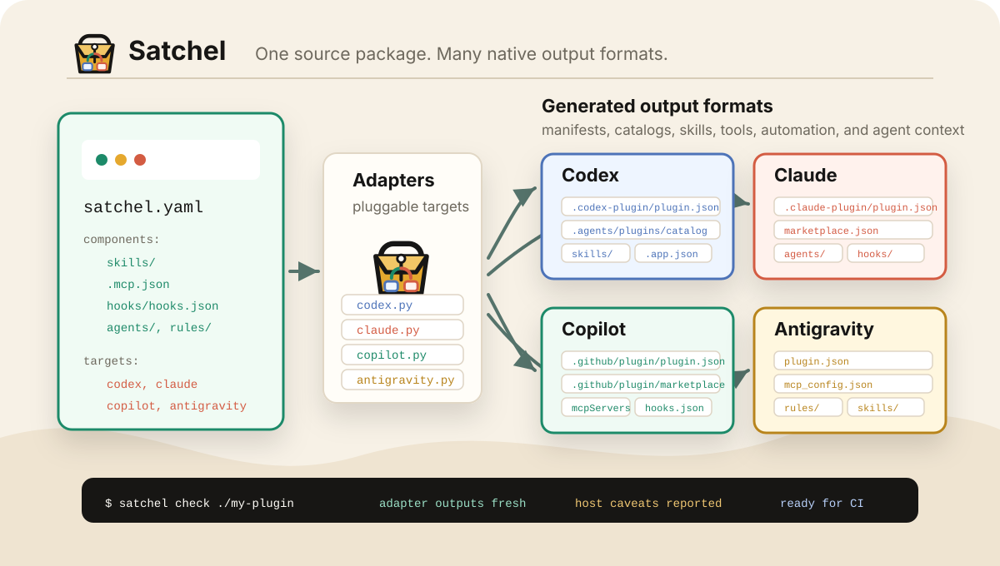

<p align="center">
  
</p>

<p align="center">
  
</p>

<h1 align="center">Satchel</h1>

<p align="center">
  <strong>Satchel lets agent plugin authors build multi-target extensions from one source package.</strong>
</p>

<p align="center">
  <a href="https://github.com/parkerhancock/satchel/actions/workflows/ci.yml"></a>
  <a href="https://pypi.org/project/satchel-agent/"></a>
  <a href="LICENSE"></a>
</p>

<p align="center">
  <a href="#quick-start">Quick Start</a> |
  <a href="#features">Features</a> |
  <a href="#usage">Usage</a> |
  <a href="#release-readiness">Release Readiness</a>
</p>

> Status: open-source alpha. Satchel generates and checks Codex, Claude Code,
> GitHub Copilot CLI, and Microsoft 365 Copilot Cowork packages. It also
> supports ChatGPT app and Anthropic Connectors Directory release metadata,
> plus experimental Antigravity packages.
>
> Note: the `claude` target builds a Claude Code **plugin**; the `anthropic`
> target builds an Anthropic **Connectors Directory** submission (a remote MCP
> server listing). They are different distribution channels.

## Why Satchel

Modern agent plugins share useful building blocks: skills, `SKILL.md`
metadata, supporting files, MCP configuration, hooks, and subagent definitions.
Their manifests and marketplace catalogs are different enough that multi-target
plugin repos can drift.

Satchel makes `satchel.yaml` the source of truth. Authors edit one portable
package, then generate host-specific files and fail CI when generated outputs
are stale.

## Quick Start

```bash
uvx --from satchel-agent satchel init my-plugin
uvx --from satchel-agent satchel generate my-plugin
uvx --from satchel-agent satchel check my-plugin
uvx --from satchel-agent satchel smoke my-plugin
```

The starter enables Codex, Claude, and Copilot. Its generated files live at:

```text
my-plugin/.codex-plugin/plugin.json
my-plugin/.claude-plugin/plugin.json
my-plugin/.github/plugin/plugin.json
my-plugin/.github/plugin/marketplace.json
```

Enable additional targets in `satchel.yaml`. Cowork needs Microsoft app
metadata and PNG icons, while ChatGPT and Anthropic require an already deployed
remote HTTPS MCP service. See the [schema guide](docs/schema.md).

## Plugin Install

Satchel is packaged with Satchel. The repository root contains `satchel.yaml`,
the generated host manifests, generated marketplace files, and a shared
`skills/satchel/SKILL.md`.

Claude Code:

```bash
claude plugin marketplace add parkerhancock/satchel
claude plugin install satchel@satchel-marketplace
```

Codex:

```bash
codex plugin marketplace add parkerhancock/satchel
```

Then restart Codex, open the plugin directory, choose the Satchel marketplace,
and install the Satchel plugin. Codex can also read the generated repo
marketplace at `.agents/plugins/marketplace.json`, which points back to the
Git-backed Satchel plugin source.

GitHub Copilot CLI:

```bash
copilot plugin marketplace add parkerhancock/satchel
copilot plugin install satchel@satchel-marketplace
```

Microsoft 365 Copilot Cowork has no marketplace command in Satchel. Build its
target archive with:

```bash
satchel pack . --target cowork --release
```

The archive contains the shared Satchel skill and repository code alongside
the generated Unified App Manifest. Satchel does not automate tenant
installation; use the generated manifest and assets in the host-controlled
Microsoft 365 packaging and publication flow appropriate to the tenant.

Antigravity support is experimental. The adapter can generate a local package
layout under `.agents/plugins/`, but install and marketplace behavior should be
verified against the current Antigravity CLI or IDE before relying on it.

### Self-hosting matrix

Satchel's own `satchel.yaml` packages the Satchel skill and repository code for
Codex, Claude Code, GitHub Copilot CLI, Microsoft 365 Copilot Cowork, and
experimental Antigravity. Cowork is a skill-only host output and does not
declare an MCP connector.

The ChatGPT App and Anthropic Connectors Directory channels are explicitly
not applicable to Satchel itself because those channels publish remote MCP
services rather than repository-backed skills. The Codex and Claude Code
targets are the corresponding file-based Satchel packages.

## Features

| Feature | What it does |
| --- | --- |
| **Neutral manifest** | Reads `satchel.yaml` as the package source of truth. |
| **Target adapters** | Emits deterministic Codex, Claude, Copilot, Cowork, ChatGPT, Anthropic, and experimental Antigravity outputs through pluggable adapters. |
| **Drift checks** | Fails when generated outputs are missing or stale. |
| **Smoke tests** | Copies a package to a temporary directory, regenerates output, and validates the clean copy. |
| **Host validation** | Runs non-mutating host validators where available, including `claude plugin validate` and `agy plugin validate`. |
| **Marketplace patching** | Preserves host-owned marketplace metadata when `marketplace.patch: true` is set. |
| **Path safety** | Rejects component and output paths that escape the package root. |
| **Skill validation** | Checks each skill directory for `SKILL.md`, `name`, and `description`. |
| **Fixture suite** | Exercises skills-only, MCP, target-rich, Antigravity, and unsupported-target packages. |
| **Portability report** | Summarizes target support and shared components. |

## Usage

Install from PyPI:

```bash
uv tool install satchel-agent
satchel --version
```

For one-off use without installing:

```bash
uvx --from satchel-agent satchel --help
```

Create a package:

```bash
uv run satchel init my-plugin
```

Generate host manifests:

```bash
uv run satchel generate my-plugin
```

Check source validity and generated-file drift:

```bash
uv run satchel check my-plugin
```

Run host-aware validation when the host CLIs are installed:

```bash
uv run satchel check my-plugin --host
```

Run release installability checks before publishing:

```bash
uv run satchel check my-plugin --release
```

Write machine-readable diagnostics:

```bash
uv run satchel check my-plugin --json
```

See the [diagnostic reference](docs/diagnostics.md) for diagnostic codes and
remediation guidance, the [marketplace guide](docs/marketplaces.md) for
installability workflows, and the [host validator guide](docs/host-validators.md)
for host-aware checks.

Run a clean-copy smoke test:

```bash
uv run satchel smoke my-plugin
uv run satchel smoke my-plugin --target claude
```

Build a target-specific archive without mutating the source tree:

```bash
uv run satchel pack my-plugin --target claude --release
```

For Git repositories, the archive includes tracked and unignored source files,
including implementation code, and regenerates the selected target's outputs
in a clean copy. Satchel therefore packages skill-plus-code repositories; it
does not require a package to be skill-only.

Print a portability report:

```bash
uv run satchel report my-plugin
```

## Manifest

Starter-style skills package:

```yaml
schema: satchel/v0
name: my-plugin
version: 0.1.0
description: Shared agent extension.
author:
  name: Your Team

components:
  skills:
    path: ./skills

targets:
  codex:
    enabled: true
    manifest: ./.codex-plugin/plugin.json
    interface:
      displayName: My Plugin
      shortDescription: Shared agent extension.
      category: Productivity
      capabilities:
        - Read

  claude:
    enabled: true
    manifest: ./.claude-plugin/plugin.json
    displayName: My Plugin

  copilot:
    enabled: true
    manifest: ./.github/plugin/plugin.json
    marketplace:
      path: ./.github/plugin/marketplace.json
      patch: true

  antigravity:
    enabled: false
    experimental: true
    output: ./.agents/plugins/my-plugin
```

For a repository-backed package with no remote MCP service, document why the
remote-only channels do not apply:

```yaml
targets:
  chatgpt:
    enabled: false
    notApplicable: This package has no remote MCP service.
  anthropic:
    enabled: false
    notApplicable: This package has no remote MCP service.
```

See the [manifest guide](docs/schema.md) for Cowork application metadata,
remote ChatGPT and Anthropic metadata, MCP configuration, and every supported
component.

## Output Model

| Source | Codex | Claude | Copilot | Cowork | ChatGPT | Anthropic | Antigravity |
| --- | --- | --- | --- | --- | --- | --- | --- |
| `name`, `version`, `description` | `.codex-plugin/plugin.json` | `.claude-plugin/plugin.json` | `.github/plugin/plugin.json` | `cowork/manifest.json` | `chatgpt/app.json` | `anthropic/connector.json` | generated `plugin.json` |
| `components.skills.path` | `skills` field | `skills` field | `skills` field | `agentSkills` field | ignored | ignored; skills ship via `claude` | copied to `skills/` |
| `components.mcp.path` | `mcpServers` field | `mcpServers` field | `mcpServers` field | local servers are rejected; use `targets.cowork.connector` | runtime is `targets.chatgpt.app.mcpUrl` | runtime is `targets.anthropic.connector.mcpUrl` | copied to `mcp_config.json` |
| `components.hooks.path` | `hooks` field | `hooks` field | `hooks` field | ignored | ignored | ignored | copied to `hooks.json` |
| host-specific target fields | `targets.codex.interface` | `targets.claude.displayName` | target metadata | developer, icons, accent color, and optional connector | `targets.chatgpt.app` | `targets.anthropic.connector` | `targets.antigravity.output` |
| marketplace config | `.agents/plugins/marketplace.json` | `.claude-plugin/marketplace.json` | `.github/plugin/marketplace.json` | unsupported | submission metadata only | submission metadata only | unsupported |

Generated manifests should be treated as build outputs. Edit `satchel.yaml`
instead. If a marketplace file must retain host-owned fields, set
`targets.<target>.marketplace.patch: true`; Satchel will update the generated
plugin entry while preserving unrelated plugin entries and unknown metadata.

## Commands

| Command | Purpose |
| --- | --- |
| `satchel init <path>` | Create a minimal package with `satchel.yaml` and one skill. |
| `satchel generate <path>` | Generate enabled host manifests. |
| `satchel check <path>` | Validate source and fail on stale generated files. |
| `satchel check <path> --host` | Add non-mutating host validators when available. |
| `satchel check <path> --release` | Require remote marketplace sources for release installability. |
| `satchel check <path> --json` | Write machine-readable diagnostics with stable codes. |
| `satchel smoke <path>` | Validate a regenerated temporary copy without mutating the source tree. |
| `satchel smoke <path> --target <target>` | Validate only one enabled target in a clean temporary copy. |
| `satchel pack <path> --target <target>` | Build `dist/<name>-<version>-<target>.zip` from a clean regenerated copy. |
| `satchel pack <path> --target <target> --release` | Run release checks before building the selected archive. |
| `satchel report <path>` | Print a simple portability report. |
| `satchel standards check <path>` | Compare upstream host standards sources with committed snapshots. |
| `satchel standards check <path> --update` | Accept current upstream standards into committed snapshots after review. |
| `satchel standards check <path> --include-commands` | Also run configured local CLI help probes. |
| `satchel --version` | Print the installed Satchel version. |

## Release Readiness

The repository includes the release-readiness pieces needed for an open-source
alpha:

| Area | Status |
| --- | --- |
| Host validation | `satchel check --host` uses a host validator registry, runs native Claude and Antigravity validation when available, and reports structural fallbacks for hosts without stable validators. |
| Standards watch | `standards/sources.yaml`, `satchel standards check`, and `.github/workflows/standards-watch.yml` track upstream host docs and open an issue on drift. |
| Claude PR workflow | `.github/workflows/standards-claude-pr.yml` lets a maintainer manually dispatch a reviewed standards issue to the official Claude app. |
| Clean smoke tests | `satchel smoke` regenerates and validates a temporary package copy; `--target` scopes the smoke run to one host. |
| CI | `.github/workflows/ci.yml` runs lint, tests, schema-doc checks, release checks, host-aware smoke tests, and archives for all five applicable self-host targets. |
| Packaging | `satchel pack --target` builds target-specific plugin archives; `pyproject.toml` and `.github/workflows/publish.yml` handle the Python package release. |
| Project hygiene | `CONTRIBUTING.md`, `SECURITY.md`, `ROADMAP.md`, and issue templates are present. |
| Schema docs | `docs/schema.md`, generated `docs/schema-reference.md`, and `schemas/satchel.schema.json` document the manifest. |
| Fixtures | `fixtures/` covers skills-only, skills-and-MCP, Claude-rich, Codex-rich, Copilot-rich, Antigravity-rich, and unsupported-target packages. |
| Demo | `examples/release-auditor/` is a non-trivial generated multi-target plugin. |

Operational release steps are documented in `docs/release.md`: configure PyPI
trusted publishing, cut a GitHub release, then verify
`uv tool install satchel-agent` or `pipx install satchel-agent` after
publishing. The installed CLI command is still `satchel`.

Good follow-up work after public alpha:

- optional `plugin-scanner verify` integration
- concrete host validators as more CLIs expose non-mutating plugin validation

## Development

```bash
uv run ruff check .
uv run pytest
uv run satchel check .
uv run satchel smoke .
uv run satchel standards check .
uv run satchel report examples/basic
```

## License

Satchel is released under the [MIT License](LICENSE).
